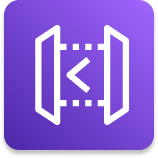

	 
   
	<h1 align="center">
    API Gateway
  </h1>

	

 

## :pushpin: Índice

- [Introdução](#introdução)
- [Estágios de implantação](#estágios-de-implantação)
- [Caching respostas da API](#caching-respostas-da-api)
- [Plano de uso e chaves de api](#plano-de-uso-e-chaves-de-api)
- [Registro e Rastreamento](#registro-e-rastreamento)
  - [Métricas Cloudwatch](#métricas-cloudwatch)
- [Throttling](#throttling)
- [Erros](#erros)
- [Segurança](#segurança)  
- [Referências](#books-referências)

 

## Introdução

Amazon API Gateway é um serviço da AWS para criar APIs REST e Websocket, também publicar, monitorar e proteger suas APIs.

 

## Estágios de implantação

Para que as alterações feitas no API Gateway é necessário fazer a implantação(*deploy*) para que a modificações sejam refletidas em um estágio(ex: dev, homol, prod).

 

## Caching respostas da API

O cache reduz o número de chamadas feitas para o backend. O TTL padrão é de 300 segundos (mínimo de 0s, máximo 3600s).
O cache é definido por estágio. É possível sobrescrever as configurações de cache por método e ele pode ser criptografado.
Sua capacidade fica entre 0.5GB até 237GB.
Cache é muito caro, portanto faz mais sentido utilizar em ambiente de produção.

 

## Invalidação de Cache

Você pode fazer a invalidação por meio do painel da AWS ou os clientes podem invalidar o cache enviando um ***header***(cabeçalho) com header: `Cache-Control:max-age=0` com a permissão apropriada do IAM. 

 

## Plano de uso e chaves de api

Pode se utilizar o plano de uso para definir quem pode acessar os estágios e métodos da api, quanto a velocidade e limite/quota de acesso.
São usadas as chaves de api para identificar os clientes da api e medir o seu acesso.

 

## Registro e Rastreamento

O API Gateway pode enviar logs para o Cloudwatch Logs no nível de stage(estágio), as configurações podem ser sobrescritas por api.
X-Ray também pode ser usado com o API Gateway para obter informações adicionais sobre as requisições feitas.

### Métricas Cloudwatch

- **CacheHitCount** e **CacheMissCount:** Eficiência do cache. **CacheMissCount** fornece informações sobre a eficiência do cache, se o valor dele for muito alto é que o cache está sendo eficiênte, do contrário se for um valor muito baixo o cache não está sendo eficiênte.
- **Count:** Número de requisições da api em um determinado período
- **IntegrationLatency:** É o tempo que leva para uma solicitação chegar ao back-end e aguardar a resposta do back-end
- **Latency:** É o tempo de resposta entre a requisição feita do cliente até a resposta para o mesmo (inclui o IntegrationLatency)
 
 

## Throttling

- **Limite de Conta:** Por padrão **o API Gateway limitará as solicitações em 10.000 por segundo** em todas as APIS, podendo ser aumentado mediante solicitação a AWS. **Se uma de suas APIs estiver sob uso intenso as outras API poderão também ser limitadas**, nesse caso é comum receber o **erro de *status code* 429 Too Many Request** que significa solicitações em excesso
- Você pode definir um limite por estágio e um limite por métodos para aprimorar a performance
- Ou definir uma Plano de Uso por cliente

 

## Erros

- **4xx Erros de cliente**
  - 400: *Bad Request* (Requisição incorreta)
  - 403: *Access Denied* (acesso negado), filtrado por WAF
  - 429: *Too Many Request* (quota do limite excedida)
- **5xx Erros de servidor**
  - 502: *Bad Gateway Exception*, pode significar que sua integração com uma função lambda não respondeu
  - 503: *Service Unavailable Exception*, o serviço de back-end não está disponível
  - 504: *Integration Failure*, o API Gateway fez uma solicitação para o back-end e não recebeu uma resposta em 29 segundos

 

## Segurança

- Permissões IAM: Bom para usuários/funções já criadas na sua conta da AWS + Resource polices para acessos entre contas AWS
- Resource policies (Políticas de recursos)
- Cognito User Pools: Onde você gerencia o seu próprio *user pool*, não necessita nenhum código personalizado
- Lambda Authorizer (Custom Authorizer): Exemplo de caso de uso é que é ótimo quando você tem um banco de dados de usuários de terceiros

 

## :books: Referências

Para uma compreensão mais profunda sobre Amazon API Gateway recomendo a leitura da documentação oficial, os links estão abaixo.

- [O que é o Amazon API Gateway?](https://docs.aws.amazon.com/pt_br/apigateway/latest/developerguide/welcome.html)
- [Criar e usar planos de uso com chaves de API](https://docs.aws.amazon.com/pt_br/apigateway/latest/developerguide/api-gateway-api-usage-plans.html)

 

---
Feito com ♥ by :man_astronaut: Guilherme Bezerra :wave: [Entrar em contato!](https://www.linkedin.com/in/gbdsantos/)
