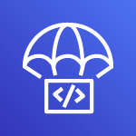

<div style="display: flex; align-items: center;">
	 
	<h1 style="border-bottom: none; margin-left: 10px;"> 
		CodeDeploy
	</h1>
</div>

## :pushpin: Índice

- [Introdução](#introdução)
- [Passo a passo](#passo-a-passo)
- [Opções de implantação](#opções-de-implantação)
- [Configuração de implantação](#opções-de-implantação)
- [Implantação com ASG](#implantação-com-asg)
- [Referências](#books-referências)

<br />

## Introdução

O CodeDeploy é um serviço de implantação que automotiza implatações de aplicações em instâncias EC2, funções lambdas ou serviços ECS.

É importante salientar que o **CodeDeploy ≠ Elastic Beanstalk**.

- Plataformas computacionais suportadas pelo CodeDeploy: EC2/Servidores Locais, Lambda ou ECS

<br />

## Passo a passo

- Cada instância EC2/Servidores locais(on-premises) devem estar executando o **CodeDeploy Agent** para o CodeDeploy funcionar
- O CodeDeploy Agent ficará perguntando para o AWS CodeDeploy se existe algum implementação(*deploy*) para ser feito
- Caso haja um, será extraído do repositório o código-fonte da aplicação + arquivo `appspec.yml` do Bitbucket, Github ou S3.
- As instâncias EC2 irão executar as instruções de implantação(*deploy)* no arquivo `appspec.yml`
- Por fim será relatado pelo CodeDeploy Agent se o resultado da implantação(*deploy*) foi de sucesso ou falha para o serviço CodeDeploy

- Exemplo do arquivo `appspec.yml`

```YAML
version: 0.0
os: linux

files: 
	- source: Config/config.txt
		destination: /webapps/Config
	- source: source
		destination: /webapps/myApp

hooks:
	BeforeInstall: 
		- location: Scripts/UnzipResourceBundle.zip
		- location: Scripts/UnzipDataBundle.zip
	AfterInstall:
		- location: Scripts/RunResourceTests.sh
			timeout: 180
	ApplicationStart:
		- location: Scripts/RunFunctionalTests.sh
			timeout: 3600
	ValidateService:
		- location: Scripts/MonitorService.sh
			timeout: 3600
			runas: codedeployuser
```

<br />

## Opções de implantação

- **Implantação no local(*In-place deployment*)**
- **Implantação azul/verde(*Blue/Green*)**
    - Em instâncias EC2/Servidores locais(*On-Premises*)
    - Em Lambda ou ECS
    - Por meio do Cloudformation

<br />

## Configuração de implantação

Existem os seguintes tipos:

- **Canary**
- **Linear**
- **All-at-once(Tudo de uma vez)**


<br />

## Implantação com ASG

- **Implantação In-place:** Atualiza instâncias EC2 existentes
- **Implantação Azul/Verde(*Blue/Green*) :** Um novo Auto-Scaling Group é criado e deve usar um ELB


<br />

## :books: Referências

Para uma compreensão mais profunda sobre CodeDeploy recomendo a leitura da documentação oficial, os links estão abaixo.

- [O que é CodeDeploy?](https://docs.aws.amazon.com/pt_br/codedeploy/latest/userguide/welcome.html)
- [Visão geral dos tipos de implantação](https://docs.aws.amazon.com/pt_br/codedeploy/latest/userguide/welcome.html#welcome-deployment-overview) 
- [Componentes primários do CodeDeploy](https://docs.aws.amazon.com/pt_br/codedeploy/latest/userguide/primary-components.html)

<br />

---
Feito com ♥ by :man_astronaut: Guilherme Bezerra :wave: [Entrar em contato!](https://www.linkedin.com/in/gbdsantos/)