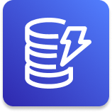

	 
   
	<h1 align="center">
    DynamoDB
  </h1>

	

 

## :pushpin: Índice

- [Introdução](#introdução)
- [Tabelas](#tabelas)
- [Keys](#keys)
- [Modo de capacidade de leitura/gravação](#modo-de-capacidade-de-leituragravação)
  - [Modo de capacidade provisionado](#modo-de-capacidade-provisionado)
    - [Write Capacity Units (WCU)](#write-capacity-units-wcu)
- [Leitura Fortemente Consistente vs Leitura Eventualmente Consistente](#leitura-fortemente-consistente-vs-leitura-eventualmente-consistente)
  - [Read Capacity Units (RCU)](#read-capacity-units-rcu)
- [API](#api)
  - [Gravação/Escrita de dados](#gravaçãoescrita-de-dados)
  - [Leitura de dados](#leitura-de-dados)
  - [Apagando dados](#apagando-dados)
  - [Operações em lote](#operações-em-lote)
- [Índices secundários](#índices-secundários)
  - [Global Secondary Index(GSI)](#global-secondary-indexgsi)
  - [Local Seconday Index(LSI)](#local-seconday-indexlsi)    
- [Referências](#books-referências)

 

## Introdução

Amazon **DynamoDB** é um banco de dados NoSQL totalmente gerenciado, altamente disponível.

Bancos de dados NoSQL são não relacionais e são distribuídos, permitindo uma escalabilidade horizontal.

Esses bancos de dados não suportam junções de consulta ou tem um suporte muito limitado.

Alguns exemplos de casos de uso para utilizar DynamoDB são em aplicativos mobile, gaming, internet das coisas (ioT), etc.

- NoSQL
- Uma média de no máximo 9ms para realizar a leitura de uma tabela
- Data models suportados
  - document (HTML, JSON, XML)
  - key-value (Tabelas)
- Consistency model
  - eventual consistent reads (padrão)
  - strong consistent reads

 

## Tabelas

O DynamoDB é feito de tabelas(*tables*). Cada tabela tem a sua **chave primária(*primary key*)** que deve ser definido no momento de criação da tabela. 
Cada tabela pode ter um número infinito de itens(rows) e cada item possui atributos(attributes).

- **Tables**
  - **Items:** linhas onde há entrada de dados. Pode ter o tamanho máximo de 400 KB
  - **Atributes:** Fazendo um comparativo com um banco de dados tradicional seriam as colunas
  - **Key:** É o título de uma coluna
  - **Value:** É o valor que está contido em uma *key*
- **Tipos de dados suportados**
    - **Scalar Types:** Binary, Boolean, Number, Null, String
    - **Document Types:** List, Map
    - **SetTypes:** Binary Set, Number Set, String Set

## Keys

- **Primary Key**
  - **Partition Key:** É um valor único(HASH) na tabela que não pode ser duplicado e você escolhe qual vai ser a sua partition key
  - **Opção 2 - Partition Key + Sort Key(HASH + Range) = Composite Key:** É a junção de uma partition key mais uma sort key

 

## Modo de capacidade de leitura/gravação

O DynamoDB disponibilizada dois tipos de modos de capacidade:

- **Modo Provisionado(Padrão):** Você define de antemão o número de leituras/escritas por segundo e será cobrado pelo quantidade especificada
- **Modo Sob demanda:** A leitura/escrita é automaticamente escalada de acordo com a carga de trabalho, não é necessário definir de antemão a capacidade e você será cobrado somente pelo que usar mas como tudo que é sob demanda na AWS é mais caro.

Você pode mudar entre os dois modos a cada 24 horas.

### Modo de capacidade provisionado

Você deve provisionar a leitura e gravação de unidades de **capacidade de leitura(RCU - *Read* *Capacity Units*)** e unidades de **capacidade de escrita(WCU - *Write Capacity Units*)**.

#### Write Capacity Units (WCU)

Uma unidade de **capacidade de escrita(WCU)** representa uma escrita por segundo para um item até de 1 KB de tamanho. Portanto se o seu item for maior que 1 KB, mais WCUs serão consumidas.

- **Exemplo 1:**  está sendo escrito 20 itens por segundo, item com o tamanho de 2KB:
  - 20 * 2 = 40 * 1 = 40 WCUs
- **Exemplo 2:** Está sendo escrito 20 itens por segundo, item com o tamanho de 2.5KB(2.5 será arredondado para cima):
  - 20 * 3 = 60 * 1 = 60 WCS
- **Exemplo 3:** Está sendo escrito 120 itens **por minuto,** item com o tamanho de 2KB:
  - (120 / 60(seg) ) * (2KB / 1KB) = 4 WCUs 

 

## Leitura Fortemente Consistente vs Leitura Eventualmente Consistente

São dois tipos de modos de leitura para DynamoDB.

- **Leitura Eventualmente Consistente(Padrão):** É possível que se obtenha dados desatualizados(por exemplo, caso quando o dado solicitado foi gravado no DynamoDB a pouco tempo) pois a replicação dos dados pelos múltiplas instâncias(servidores) ainda não foi feita
- **Leitura Fortemente Consistente:** O DynamoDB retornará os dados mais atualizados refletindo as alterações de todas as gravações feitas antes. Na  chamada da API você passará o argumento `ConsistentRead`como `true`

**Leituras Fortemente Consistente consumem o dobro de RCU**

### Read Capacity Units (RCU)

Uma unidade de capacidade de escrita(RCU) representa **uma leitura consistente** por segundo, ou **duas leituras eventualmente consistentes** por segundo **para um item de até 4KB de tamanho**. ****Portanto se o seu item for maior que 4 KB, mais RCUs serão consumidas.

- **Exemplo 1:**  Está sendo feito 10 leituras fortemente consistente por segundo, item com o tamanho de 4KB:
  - 10 * (4/4) = 10 RCUs
- **Exemplo 2:** Está sendo feito 16 leituras eventualmente consistente por segundo, item com o tamanho de 12KB:
  - (16 / 2) * (12 / 4) = 24 RCUs
- **Exemplo 3:** Está sendo feito 10 leituras fortemente consistente por segundo, item com o tamanho de 6KB
  - 10 * (8/4) = 20 RCUs (6KB foram arredondados para 8KB)

 

## API

### Gravação/Escrita de dados

- **PutItem:** Cria um novo item ou substitui um item que possui a mesma chave primária. Consome WCUs
- **UpdateItem:** Edita um atributo de um item existente ou adiciona um novo item se ele não existe. Pode ser usando com Contadores Atômicos(*Atomic Counters*)
- Escrita Condicional(*Conditional Writes*):

### Leitura de dados

- **GetItem:** Lê um item com base na sua chave primária. Por padrão é feita uma leitura eventualmente consistente, existe a opção de usar a leitura fortemente consistente mas mais RCU será utilizado.
- **Query:**
    - KeyConditionExpression
    - FilterExpression
- Scan

### Apagando dados

- **DeleteItem:** Apaga um item individual, é possível fazer uma exclusão condicional
- **DeleteTable:** Apaga a tabela todos os itens contidos nela

### Operações em lote

Também pode-se realizar operações em lote(*batch*) reduzindo assim o número de chamadas na API

- **BatchWriteItem:** Faz a escrita ou exclusão de até 25 itens em uma única chamada. Não pode fazer atualização de itens
- **BatchGetItem:** Faz a leitura de um ou mais tabelas de até 100 itens

 

## Índices secundários

### Global Secondary Index(GSI)

Os **índices secundários globais** são um alternativa para a chave primária base de uma tabela.

### Local Seconday Index(LSI)

Com **índices secundários locais** você pode consultar dados na tabela usando uma chave alternativa além de consultas só com a chave primária. É permitido criar até 5 índices secundários locais.

 

## :books: Referências

Para uma compreensão mais profunda sobre DynamoDB recomendo a leitura da documentação oficial, os links estão abaixo.

- [O que é o Amazon DynamoDB?](https://docs.aws.amazon.com/pt_br/amazondynamodb/latest/developerguide/Introduction.html)
- [Modo de capacidade de leitura/gravação](https://docs.aws.amazon.com/pt_br/amazondynamodb/latest/developerguide/HowItWorks.ReadWriteCapacityMode.html)
- [Consistência de leituras](https://docs.aws.amazon.com/pt_br/amazondynamodb/latest/developerguide/HowItWorks.ReadConsistency.html)   
- [Índices secundários](https://docs.aws.amazon.com/pt_br/amazondynamodb/latest/developerguide/HowItWorks.CoreComponents.html#HowItWorks.CoreComponents.SecondaryIndexes)