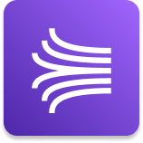

	 
   
	<h1 align="center">
    Kinesis
  </h1>

	

 

## :pushpin: Índice

- [Introdução](#introdução)
- [Kinesis Data Streams](#kinesis-data-streams)
  - [Produtores(*producers*)](#produtoresproducers)
  - [Consumidores(*consumers*)](#consumidoresconsumers)
  - [Retenção de dados](#retenção-de-dados)
  - [Cobrança](#cobrança)
  - [Kinesis Client Libray (KLC)](#kinesis-client-libray-klc)
  - [Operações com Kinesis](#operações-com-kinesis)
    - [Dividir fragmentos](#dividir-fragmentos)
    - [Mesclar fragmentos](#mesclar-fragmentos)
- [Kinesis Data Firehose](#kinesis-data-firehose)
- [Kinesis Data Analytics](#kinesis-data-analytics)
- [Referências](#books-referências)

 

## Introdução

Amazon **Kinesis** facilita a coleta, processamento e análise de dados de *streaming* em tempo real.

Esses dados podem ser qualquer coisa, por exemplo, logs de aplicações, métricas, fluxo de cliques de sites, dados de telemetria, ioT, etc.

Existem quatro serviços que compõem o Kinesis:

- **Kinesis Data Streams:** Capturar, processar e armazenar fluxos de dados
- **Kinesis Firehose:** Carregar fluxo de dados em armazenamento de dados na AWS e fora da AWS
- **Kinesis Data Analytics:** Analisar fluxo de dados com linguagem SQL ou com Apache Flink
- **Kinesis Video Streams:**  Capturar, processar e armazenar streams de vídeo**(Não aparece no exame)**

## Kinesis Data Streams

Kinesis Data Streams é uma forma de você transmitir dados em seus sistemas. Um Kinesis Data Streams é um conjunto de vários **fragmentos(*shards)**,* os fragmentos são numerados e é algo que você deve provisionar com antecedência.

### Produtores(*producers*)

Existem o **Produtores(*producers*)** são aqueles que enviam dados para o Kinesis Data Sterams. Eles produzem **registros(*data record*)** que em sua composição tem um **chave de partição(*Partition Key*)** e o ***Data Blob(tamanho de até 1MB)***, a chave de partição ajudará a determinar para qual fragmento/partição o registro irá e o Data Blob é o próprio valor.

Produtores podem enviar dados a uma taxa de 1MB/seg ou 1000 mensagens/seg por fragmentos/partições.

Produtores podem algumas das coisas abaixo:

- **AWS SDK:** produtor simples
- **Kinesis Producer Library (KPL):** C++, Java, batch...
- **Kinesis Agent:** Monitorar arquivos de logs

### Consumidores(*consumers*)

Consumidores podem ser muitas coisas, por exemplo: 

- Aplicações
- Funções Lambda
- **Kineses Data Firehose**
- **Kinesis Data Analytics**
- Consumidor Personalizado (AWS SDK) - Clássico ou Fan-Out Aprimorado
- Kinesis Client Library (KCL): Biblioteca para simplicar a leitura do *data stream*

Os consumidores recebem o registros que é composto pela chave de partição, **número sequencial(*Sequence Number*)** que representa onde o registro estava no fragmento e por fim o *Data Blob*.

Consumidores podem ter uma taxa de transferência de 2MB/seg (compartilhada) por todos os consumidores por fragmento ou 2MB por fragmento, por consumidor se estiver com o mode de consumidor aprimorado.

 

### Retenção de dados

Por padrão é de 1 dia, ou seja após passar o período de 1 dia os dados serão perdidos e vai até no máximo 365 dias.

Portanto o armazenamento de dados para o Kinesis Data Streams não é algo durável para o longo prazo.

É possível reprocessar os dados, diferentemente do SQS por exemplo que quando uma mensagem é recebida e apagada pelo consumidor.

Uma vez que os dados são inseridos no Kinesis eles não podem ser excluídos (imutabilidade)

 

### Cobrança

O faturamento é por provisão de fragmento, independente da taxa de transferência do seu Kinesis Data Streams.

 

### Kinesis Client Libray (KLC)

É uma biblioteca Java que ajuda a ler registros do Kinesis Data Stream com aplicações distribuídas compartilhando carga de trabalho de leitura.

Cada framento pode ser lido apenas por uma instância do KLC.

 

### Operações com Kinesis

#### Dividir fragmentos

**Divisão de fragmentos(*Shard Splitting*)** é utilizado para dividir um fragmento em dois, portanto se está aumenta a capacidade do Stream.
Um caso de uso comum é quando há um *hot hard* no Stream e é aplicado a divisão de fragmentos, aumentando a taxa de transferência.

O fragmento antigo será fechado e os dados expirarão de acordo com a forma de retenção de dados definida e por fim o fragmento é apagado.

Não é possível dividir um fragmento em mais de dois fragmentos em uma única operação.

#### Mesclar fragmentos

**Mesclar fragmentos(*Shard Merging*)** faz o oposto da operação anterior, é feito a união de dois fragmentos com baixo tráfego(*cold shards*).
Caso de uso comum é quando você deseja diminuir a capacidade de dois fragmentos com baixo tráfego, com isso você tem também obviamente uma redução de custo.

O fragmento antigo será fechado e os dados expirarão de acordo com a forma de retenção de dados definida e por fim o fragmento é apagado.

Não é possível mesclar um fragmento em mais de dois fragmentos em uma única operação.

 

## Kinesis Data Firehose

Serviço totalmente gerenciado *serverless* utilizado para obter dados de produtores e irá gravar esses dados em algum destino, ele é **próximo em tempo real(near real-time)** mas não em tempo real diferentemente do Kinesis Data Streams. Os destinos podem ser:

- **Destinos AWS**
  - Amazon ElasticSearch
  - Amazon Redshift
  - Amazon S3
- **Destinos de parceiros (terceiros)**
  - Datadog
  - MongoDB
  - New Relic
  - Splunk
  - e etc
- **Destinos Customizados**
  - Enpoint HTTP

 

## Kinesis Data Analytics

Kinesis Data Analytics obtem dados a partir de fontes de dados, por exemplo do próprio Kinesis Data Streams, Kinesis Data Firehose e nele é possível executar consultas SQL para analisar os dados de streaming em tempo real.

 

## :books: Referências

Para uma compreensão mais profunda sobre S3 recomendo a leitura da documentação oficial, os links estão abaixo.

- [O que é o Amazon Kinesis Data Streams](https://docs.aws.amazon.com/pt_br/streams/latest/dev/introduction.html)
- [O que é o Amazon Kinesis Data Firehose?](https://docs.aws.amazon.com/pt_br/firehose/latest/dev/what-is-this-service.html)
- [O que é o Amazon Kinesis Data Analytics para aplicativos SQL?](https://docs.aws.amazon.com/pt_br/kinesisanalytics/latest/dev/what-is.html)
