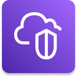

	 
   
	<h1 align="center">
    VPC
  </h1>

	

 

## :pushpin: Índice

- [Introdução](#introdução)
- [Subredes](#subredes)
- [Internet Gateway e NAT Gateways](#internet-gateway-e-nat-gateways)
- [Network ACL e Grupos de Segurança](#network-acl-e-grupos-de-segurança)
- [VPC Flow Logs](#vpc-flow-logs)
- [VPC Peering](#vpc-peering)
- [VPC Enpoints](#vpc-enpoints)
- [Referências](#books-referências)

 

## Introdução

VPC é uma sigla para ***Virtual Private Network**,* que te permite criar redes privadas na nuvem da AWS e implantar o seus recursos nela. Uma VPC é um recurso regional na AWS e abrange todas as zonas de disponibilidade daquela região.

## Subredes

É uma espécie de partição de rede dentro de uma VPC. As subnets podem estar localizadas em diferentes zonas de disponibilidade dentro da região da VPC.

Existem **subnets públicas** e **subredes privadas.** Sendo que subredes pública pode ser acessada pela internet, enquanto que subredes privadas é o contrário não podem ser acessadas pela internet.

Para permitir o acesso à internet e entre subredes é usado as tabelas de roteadores(*Route Tables*).

 

## Internet Gateway e NAT Gateways

Internet Gateways que permitem que as subredes públicas e VPC se conectarem a internet.

NAT Gateways são o que permite que recursos da AWS em subredes privadas acessem a internet enquanto se mantêm ainda privadas

 

## Network ACL e Grupos de Segurança

NACL(*Network ACL*) atua como um firewall virtual que controla o tráfego da subrede e que opera somente em nível de subrede.

## VPC Flow Logs

É a forma de monitoramento para ver logs sobre todo o tráfego é no **VPC Flow Logs**, que permite que você capture informações sobre todo o tráfego de IP de entrada e saída das interfaces VCP.

 

## VPC Peering

Usada para estabelecer conectividade entre VCPs e outras estruturas.

Conecte duas VPC que estão em regiões diferentes ou de contas da AWS diferentes.

 

## VPC Enpoints

VPC Endpoints permite que você se conecte aos serviços da AWS usando uma rede privada ao invés de utilizar uma rede pública da internet.

Isso oferece uma segurança aprimorada e menor latência para acessar serviços da AWS.

 

# Site to Site VPN e Direct Connect

- **Site to Site VPN:** Usado para conectar um Data Center local à AWS, com conexão criptografada e passará pela internet pública
- **Direct Connect (DX):** Estabelece uma conexão física com um Data Center local, ou seja a conexão será privada e não passará pela internet pública

Se você utilizar uma dessas duas conexões, ambas não conseguirão acessar VPC Endpoints. VPC endpoints são apenas para acessar os serviços da AWS em privada na sua VPC.

 

# 📚 Referências

Para uma compreensão mais profunda sobre Amazon VPC recomendo a leitura da documentação oficial, os links estão abaixo.

- [O que é Amazon VPC?](https://docs.aws.amazon.com/pt_br/vpc/latest/userguide/what-is-amazon-vpc.html)
- [Conceitos básicos da VPC](https://docs.aws.amazon.com/pt_br/vpc/latest/userguide/configure-your-vpc.html#vpc-subnet-basics)
- [Compare grupos de segurança e Network ACLs](https://docs.aws.amazon.com/pt_br/vpc/latest/userguide/what-is-amazon-vpc.html)
- [Configurar tabelas de rotas](https://docs.aws.amazon.com/pt_br/vpc/latest/userguide/VPC_Route_Tables.html)  
- [Monitoramento da sua VPC](https://docs.aws.amazon.com/pt_br/vpc/latest/userguide/monitoring.html)

 

---
Feito com ♥ by :man_astronaut: Guilherme Bezerra :wave: [Entrar em contato!](https://www.linkedin.com/in/gbdsantos/)